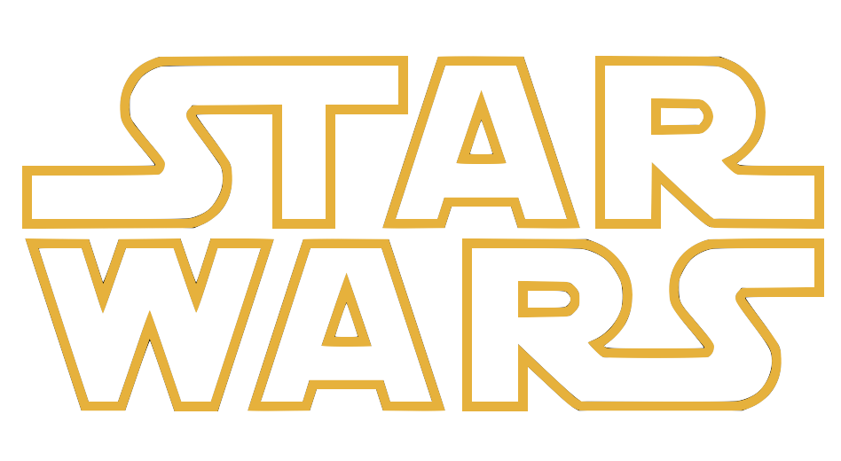

<br />

<p align="center">
  <a href="https://star-wars-beta-opal.vercel.app">
    
  </a>
</p>
<h3 align="center">Star Wars Web App</h3>
<p align="center">Star Wars is an American epic space opera[1] multimedia franchise created by George Lucas, which began with the eponymous 1977 film[b] and quickly became a worldwide pop-culture phenomenon..</p>

<br />

## Getting started

You can get Star Wars running by following the steps below:

1. **Install NodeJS**
    - NodeJS >=14.19.1 <=18.x.x

2. **Install Yarn package manager**
   - Yarn >= 1.22.x

3. **Clone the project in your local environment**

     ```bash
    git clone https://github.com/jkenley/star-wars-web.git
    ```

4. **Run yarn install to install dependencies**

    ```bash
    yarn install
    ```

5. **After setting the env variables, you can safely start the development server**.

    ```bash
    yarn dev
    ```

<br />

## License

See the [LICENSE](./LICENSE) file for licensing information.
